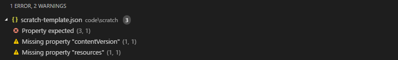
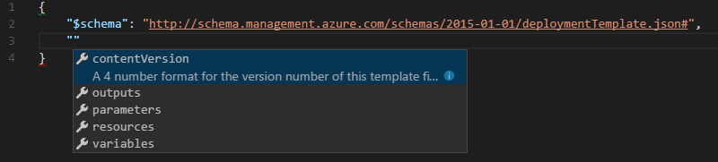
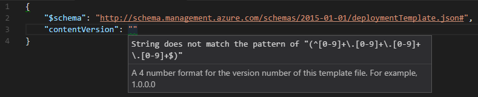
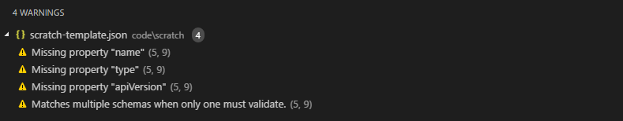
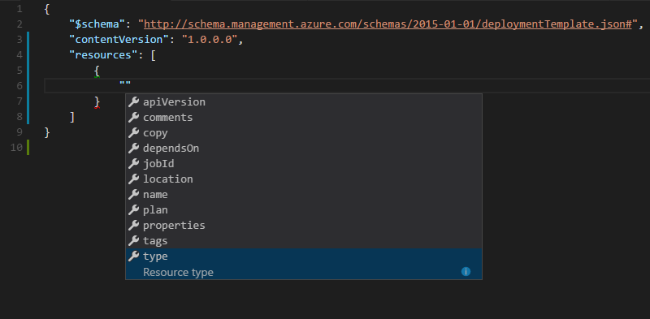
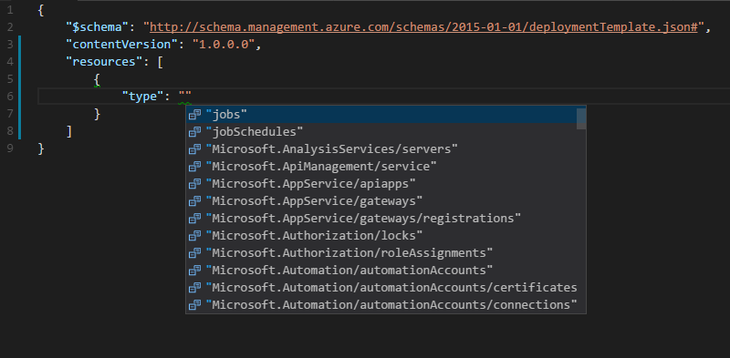
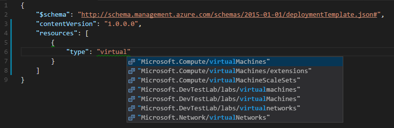

# The Faff-Free Guide to Azure Resource Manager

## Creating and Editing Templates with Visual Studio Code

Azure Resource Manager (ARM) templates are plain text files and can be created or edited in any text editor. I recommend [Visual Studio Code](https://code.visualstudio.com/) as the best tool for template creation and editing. There are a lot of choices when it comes to text editors, but I like **Code** because it's quick and easy to install, it has a large and growing library of high quality extensions and it's under active development with new features and refinements being added every month. On top of that, Code works on Windows, macOS or Linux and it's [open source](https://github.com/Microsoft/vscode).

Code isn't just a text editor, it's a development environment. Because of this, Code can help you create and edit your template, pointing out problems and helping you fix them as you go.

### Installing Visual Studio Code
(install code on Surface Pro, record first time install experience)

### Installing Visual Studio Code Extensions for Azure Resource Manager

(do you need anything in particular for Code to read JSON schema?)
(What does the ARM extension do specifically?)
(Install the Azure Tools extension)

### How Does Visual Studio Code Help You Create and Edit ARM Templates?

Open Visual Studio Code and create a new file with a `.json` extension. Code should automatically determine from the extension that this is a JSON file. If you check the bottom right of Code's application window, it will tell you what the current language mode is. If it hasn't switched to JSON for some reason, you can manually select JSON from the *Command Palette* by pressing CTRL-SHIFT-P, then type `language` and select "Change Language Mode", then type and select JSON.

Next, open up the "Problems" panel either by pressing CTRL-SHIFT-M or choosing "Problems" from the "View" menu.  I find it useful to have the Problems panel open whilst developing as it helps identify issues with your template, as I'll demonstrate now.

Let's start by creating the minimum required for a JSON document.  In our case, an empty object.  So, just type an empty curly bracket or brace `{` and Code should auto-complete the closing brace for you. Press enter and Code will reformat the layout and position the cursor ready for your first line.

    {

    }

Next, type a quote `"` and Code should automatically prompt you with the option to insert `$schema`

(image of Code prompting)

At this point, simply press the tab key on your keyboard and Code will auto-complete adding `$schema`, closing quote and a colon.

    {
        "$schema":
    }

Now, Code is a good tool, but here you have to give it a little clue as to which JSON schema you want to use.  Complete the line by adding the reference to the Azure Resource Manager schema.

    {
        "$schema": "http://schema.management.azure.com/schemas/2015-01-01/deploymentTemplate.json#"
    }

If you look at your Problems panel now, it should now be telling you that there's something wrong with your template. Specifically that it's missing two properties - `contentVersion` and `resources`. 

Code [understands JSON schema defintions](https://code.visualstudio.com/Docs/languages/json#_json-schemas-settings), so as you type it's reviewing the schema you've referenced and is validating your JSON document against that schema.  In this case, it's detected that the ARM deployment template schema specifies that `$schema`, `contentVersion` and `resources` must all be present for a template to be valid. So, let's add those to the template.

When there are multiple items within a JSON object or array, they are separated with commas. So, begin by adding a comma right at the end of the `$schema` line and then press enter. Code should line the cursor up right underneath the schema line. Next, type the first quote and Code will now pop up a list of possible properties.

*Note* - if Code doesn't display the list, press CTRL + SPACE to manually reveal it.

Here we see that Code is suggesting five possible properties that we might want to insert. You can see the three mandatory properties that we've previously discussed as well as two optional properties. Let's start with `contentVersion`. As it's already highlighted, just press the tab key and Code will add the property along with the colons and quotes needed.

    {
        "$schema": "http://schema.management.azure.com/schemas/2015-01-01/deploymentTemplate.json#",
        "contentVersion": ""
    }

Good, but what value do we place inbetween the quotes for the `contentVersion`? Code, and the template schema, can help us again.  At this point, if you check your Problems panel, it will tell you what value it is expecting to find.

    'String does not match the pattern of "(^[0-9]+\.[0-9]+\.[0-9]+\.[0-9]+$)"'

That's useful, but what if you're not great at reading [regular expressions](https://msdn.microsoft.com/en-us/library/az24scfc(v=vs.110).aspx)? Well in that case you can simply hover your mouse cursor over the pair of quotes to the right of `contentVersion` and Code will help you out.

It repeats the warning we saw in the Problem panel but *also* it displays helpful information that it's found in the schema. In this case, it's telling us we need 4 numbers here, for example 1.0.0.0. So let's follow that advice and complete this line.

    {
        "$schema": "http://schema.management.azure.com/schemas/2015-01-01/deploymentTemplate.json#",
        "contentVersion": "1.0.0.0"
    }

Now the only thing we'll be missing is the `resources` section. As with `contentVersion` Code will help us to complete this. Add a comma to the end of the `contentVersion` line, press enter to start a new line, then type a quote. Once again, Code will pop up a list of possible properties, so this time choose `resources` from the list and hit enter. Code will add the resources line as well as a pair of square brackets `[]`. The `resources` section is an array, a list of all of the resources we're going to deploy. In JSON, the contents of an array are placed within square brackets.

    {
        "$schema": "http://schema.management.azure.com/schemas/2015-01-01/deploymentTemplate.json#",
        "contentVersion": "1.0.0.0",
        "resources": [
            
        ]
    }

It's entirely possible, and from my experience, highly desirable, to continue creating a template from scratch, simply using Code to prompt you as to what's needed to make a valid template. I personally found this a great way to learn how Azure Resource Manager templates work. To demonstrate, I'll start the process of adding a resource in the `resources` section. The other posts in this series will go into specific detail as to how different kinds of resource can be deployed.

### Add a Resource to the Deployment Template

As you can probably guess by now, we'll start by typing a quote in between the square brackets of the "resources" section to get some pointers as what our options are.

    {
        "$schema": "http://schema.management.azure.com/schemas/2015-01-01/deploymentTemplate.json#",
        "contentVersion": "1.0.0.0",
        "resources": [
            ""
        ]
    }

Ah! Doing that didn't give us a list of options, it created a warning. But, the warning is helpful. It's telling us that it's not expecting a property at this point, it's expecting an object. In JSON, objects are placed within curly braces `{}` so let's delete the quotes we just typed and type an opening curly brace `{` instead.

    {
        "$schema": "http://schema.management.azure.com/schemas/2015-01-01/deploymentTemplate.json#",
        "contentVersion": "1.0.0.0",
        "resources": [
            {}
        ]
    }

That's better! In the Problems panel we now see a list of properties that are expected when defining a resource. With the cursor between the two curly braces, press enter and type a quote.

From the information in the Problem pane, it appears that the `name`, `type` and `apiVersion` properties are mandatory, so we need to provide those. It makes sense that if we're going to deploy a resource, one of the first things we'd want to tell Azure is what type of resource we want to deploy. So, select `type` from that list and press enter.

    {
        "$schema": "http://schema.management.azure.com/schemas/2015-01-01/deploymentTemplate.json#",
        "contentVersion": "1.0.0.0",
        "resources": [
            {
                "type": ""
            }
        ]
    }

What resource types can we specify here? Place the cursor between the two quote marks and press CTRL + SPACE to see a list of options

In this example, we're going to begin to deploy a virtual machine. We can either scroll through the list to find what we want, or we can type some text to start filtering.  Let's type `virtual` and see if we can find what we want.

In this filtered list, we can see `Microsoft.Compute/virtualMachines". That's the one we need, so let's select it. We can continue down this path, checking the Problems panel for messages and using Visual Studio Code's helpful hints to continue populating our template, but there are also some other ways in which Visual Studio Code simplifies template authoring.

Link to the Getting Started Quickly doc and the sections on snippets and quickstart templates

### Add a Resource to the Deployment Template Using Snippets

**CHECK** Do you need to preinstall snippets as per https://docs.microsoft.com/en-us/azure/azure-resource-manager/resource-manager-vs-code

### Using an Azure QuickStart Template

The purpose of this post is to demonstrate how Visual Studio Code can be used to help with the creation and editing of Azure Resource Manager templates, so I won't go any further with the creation of this particular template. But from what you've read here, you should be able to see that Visual Studio Code is an extremely useful tool for working with templates.